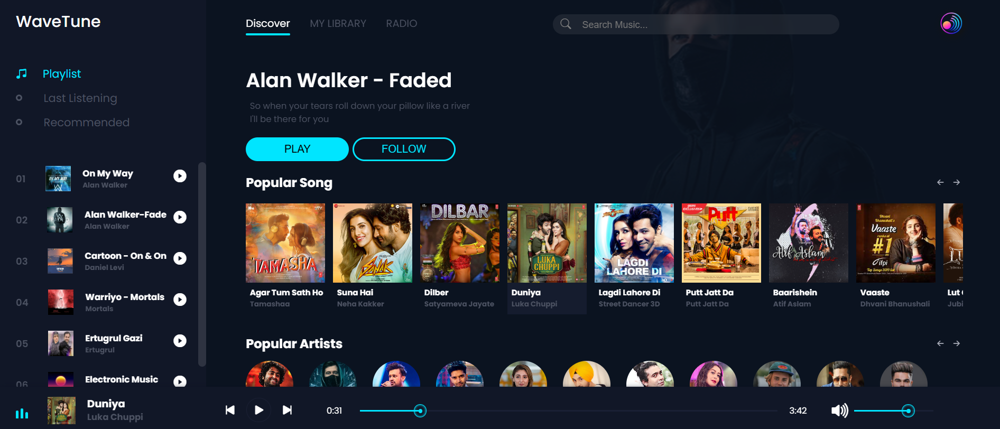
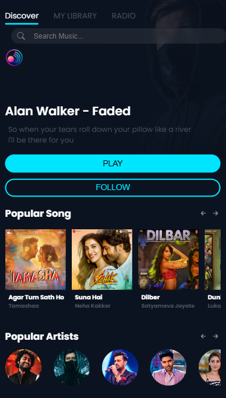

# 🎵 WaveTune – Music Player Web App

WaveTune is a modern and responsive **web-based music player** built using **HTML, CSS, and Vanilla JavaScript**.
It provides smooth music playback, interactive controls, and a clean UI inspired by popular music streaming platforms.

This project demonstrates strong **DOM manipulation**, **audio handling**, and **UI interactivity** skills.

---

## 🌐 Live Demo

👉 https://wavetune-seven.vercel.app/

---

## 📸 Preview

<p align="center">
  
  &nbsp;&nbsp;&nbsp;
  
</p>

---

## ✨ Features

* 🎧 Play / Pause music
* ⏭️ Next & Previous track controls
* 📊 Interactive progress bar
* 🔊 Volume control with dynamic icon
* 🎵 Song playlist selection
* 🌊 Animated waveform while playing
* 📱 Responsive design
* 🎨 Clean and modern UI

---

## 🛠️ Tech Stack

* HTML5
* CSS3
* JavaScript (Vanilla JS)

---

## 📂 Project Structure

```
├── index.html
├── style.css
├── app.js
├── pcSnap.png
├── mobSnap.png
├── audio/
└── img/
```

---

## 🚀 Getting Started

### 1️⃣ Clone the repository

```bash
git clone https://github.com/aditya-ojha-dev/your-repo-name.git
```

### 2️⃣ Open the project

Simply open `index.html` in your browser.

---

## 🎯 Key Learning Highlights

* Audio API handling in JavaScript
* Dynamic song loading
* Custom progress & volume controls
* Advanced DOM manipulation
* Responsive music player layout

---

## 👨‍💻 Author

**Aditya Ojha**

* 💼 Open to Internship Opportunities
* 🐙 GitHub: https://github.com/aditya-ojha-dev
* 💼 LinkedIn: https://linkedin.com/in/adityaojha27
* 📧 Email: [adi27ojha@gmail.com](mailto:adi27ojha@gmail.com)

---

## ⭐ Support

If you like this project, give it a ⭐ on GitHub — it motivates me to build more!
